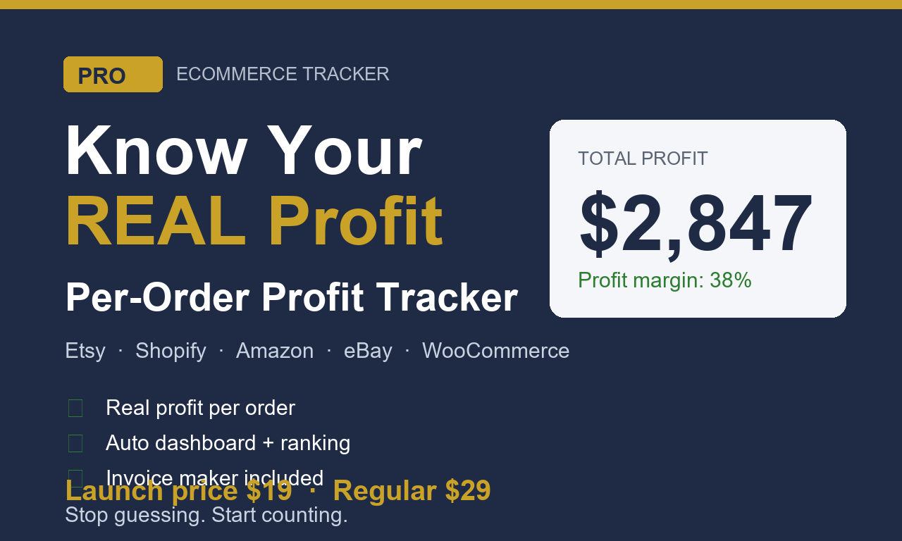
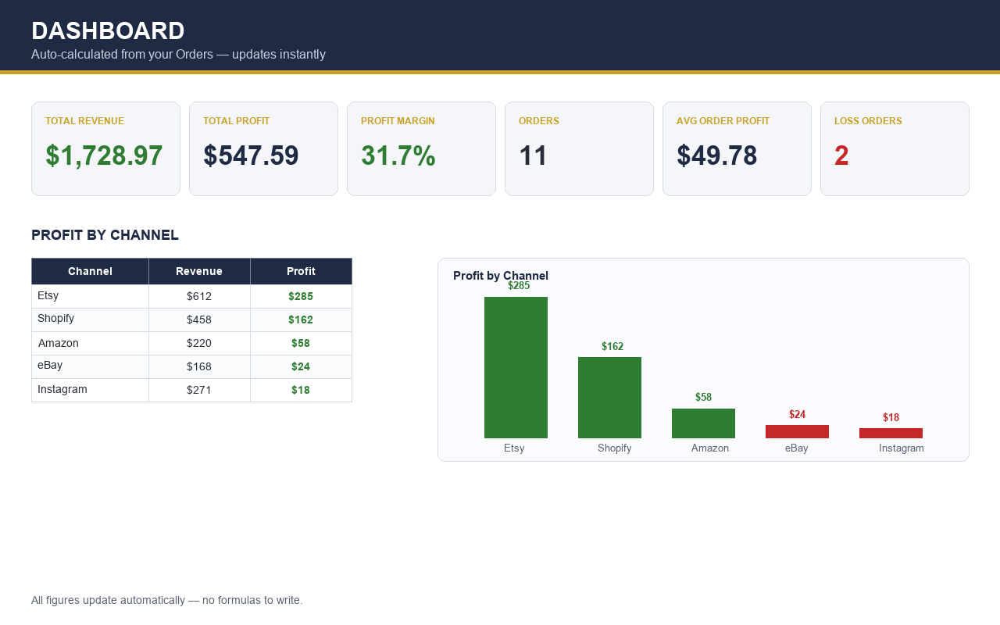
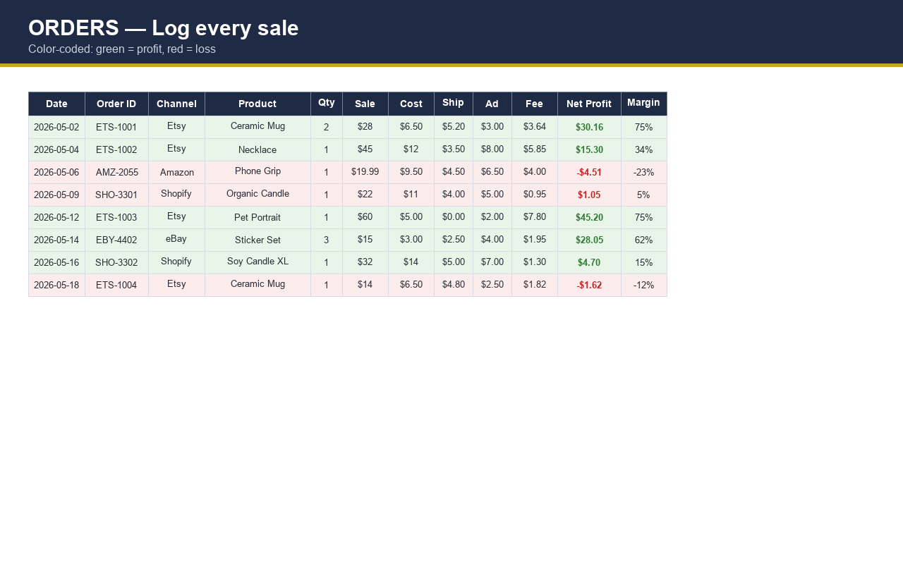
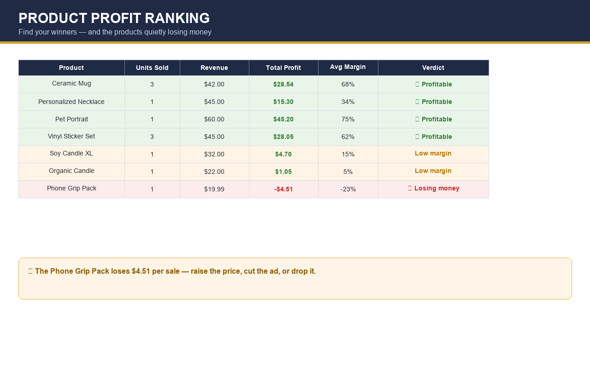
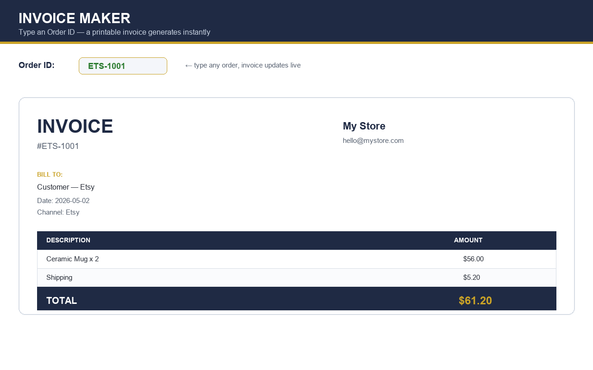
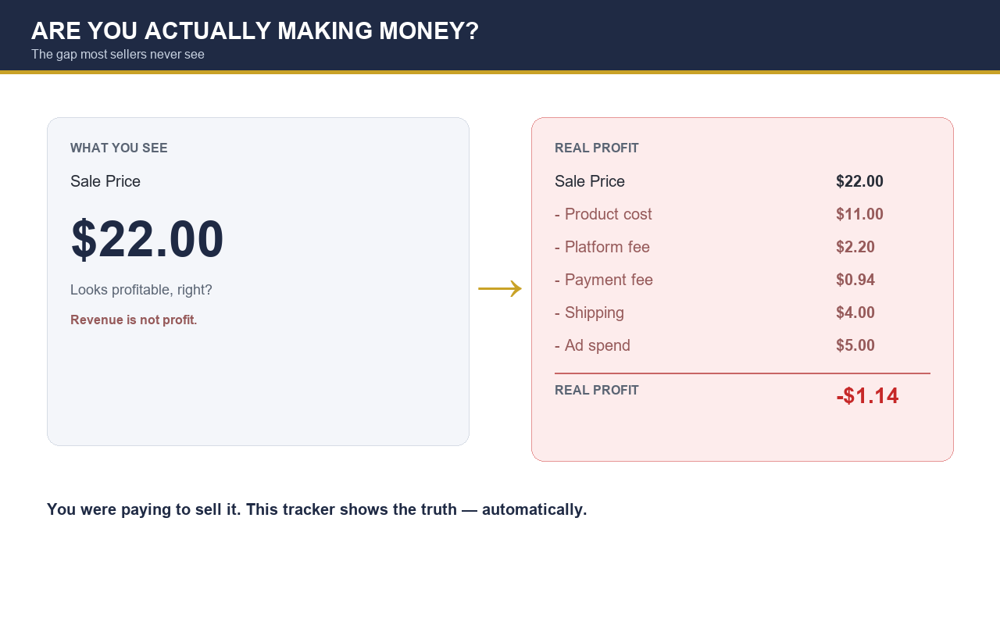

# Ecommerce Profit Tracker PRO

### Know your **REAL** profit per order. Stop guessing. Start keeping.

[🛒 **Get it now — $19**](https://checkout.dodopayments.com/buy/pdt_0NgyJZrFRp8kbH94N0kjw) · [🧮 **Try the free profit calculator**](https://limin6661.github.io/ecommerce-profit-tracker/calculator.html) · [🌐 Live Demo & Full Features](https://limin6661.github.io/ecommerce-profit-tracker/)

**Excel & Google Sheets · No subscriptions · No macros · One-time payment**

---

## The problem every seller hits

You sold **1,247 orders** last month. Shopify, Etsy, Amazon, eBay… your dashboards all say different numbers. Fees, refunds, shipping, ads, returns — they're scattered across six tabs. At the end of the month you **think** you made money, but you can't actually point to the real number.

> *"I was pricing at $24 and 'making profit' — until this spreadsheet showed me I was losing $1.80 per order after returns and ad spend."*

This is the spreadsheet that fixes that.

## What you get

A single, polished workbook with **7 connected sheets** — built in native Excel formulas (no macros, no add-ins, opens clean in Google Sheets):

| Sheet | What it does |
|-------|--------------|
| **Start Here** | Onboarding + quick setup in under 5 minutes |
| **Settings** | Your currency, fee rates, shipping costs, tax rules |
| **Orders** | Log every order; auto-calculates net profit per row |
| **Inventory** | Stock levels + reorder alerts with conditional formatting |
| **Products** | Per-product profitability ranking |
| **Invoice Maker** | Generate clean PDF-ready invoices from your data |
| **Dashboard** | One-glance KPIs: total revenue, real profit, margins, top sellers |

## Why it works

- ✅ **Sees the real profit** — every fee, refund, ad cost, and return baked into the math
- ✅ **Color-coded alerts** — losing-money products light up red instantly
- ✅ **Charts that update themselves** — no manual chart babysitting
- ✅ **Works anywhere** — Excel 2016+, Microsoft 365, Google Sheets, LibreOffice
- ✅ **Yours forever** — one-time $19, no SaaS, no login, no subscription

## Screenshots

| Dashboard | Orders | Products |
|:---------:|:------:|:--------:|
|  |  |  |

| Invoice Maker | The Reality Check |
|:-------------:|:-----------------:|
|  |  |

## Pricing

**$19 one-time.** No tiers, no upsells, no monthly fee. The price of two coffees for a tool that pays for itself the first time it catches a losing product.

👉 [**Buy now — instant download**](https://checkout.dodopayments.com/buy/pdt_0NgyJZrFRp8kbH94N0kjw)

## Who it's for

- **Etsy sellers** drowning in listing fees and shipping math
- **Shopify / DTC store owners** who need one source of truth
- **Amazon FBA sellers** tracking FBA fees + returns + ad spend
- **eBay / eBay dropshippers** reconciling multi-platform sales
- **Side-hustlers** who want to know if this thing is actually making money

## FAQ

**Does it work in Google Sheets?** Yes. Open the `.xlsx` in Google Sheets — all formulas and conditional formatting carry over.

**Do I need Excel macros enabled?** No. Pure native formulas. Nothing to enable, nothing that breaks.

**How do I get it?** Click buy, pay $19 via card/PayPal, get an instant download link. No account required.

**Can I customize it?** Fully. Add columns, change fee rates in Settings, the whole sheet recalculates.

## License

This spreadsheet is for personal/business use. Reselling or redistributing the file is not permitted.

---

### Stop guessing. Start keeping your profit.

[**🛒 Get Ecommerce Profit Tracker PRO — $19**](https://checkout.dodopayments.com/buy/pdt_0NgyJZrFRp8kbH94N0kjw)

Made for sellers, by someone who lost money to bad math.

